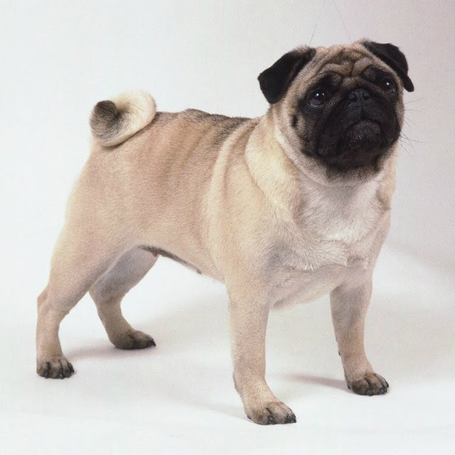

<!DOCTYPE html>
<html lang="en" dir="ltr">

<head>
  <meta charset="utf-8">
  <title>💩Bonifacius-jopikus💩 </title>
</head>

<body>
  <table cellspacing="20">
    <tr>
      <td></td>
      <td>
        <h1>Bonya Mopsik</h1>
        
<em>Fat pug <strong>jyropchik </strong> </em> 

        
<i>The pug is a breed of dog with physically distinctive features of a wrinkly, short-muzzled face, and curled tail. The breed has a fine, glossy coat that comes in a variety of colors, most often light brown or black, and a compact,
            square body
            with well-developed muscles.</i>

      </td>
    </tr>
  </table>

   
  

  <h3>Books and teaching </h3>
  <ul>
    <li>The completely fat <a href="https://www.youtube.com/watch?v=1Hxq0IQY9lA&ab_channel=PuppyLovers">doggy</a></li>
    <li>The complete my lovely puggy </li>
  </ul>
  

  <h3>Work Experience </h3>
  <table cellspacing="20">
    <thead>
      <tr>
        <th>Dates</th>
        <th>Work</th>
      </tr>
    </thead>
    <tbody>

    </tbody>
    <tfoot>

    </tfoot>
    <tr>
      <td>1200-1500</td>
      <td>ATB MARKET</td>
    </tr>
    <tr>
      <td>1500-1900</td>
      <td>Le silpo</td>
    </tr>
  </table>
  

  <h3>Skills</h3>
  <table cellspacing="10">
    <tr>
      <td>Grunting</td>
      <td>🐖🐖🐖🐖🐖</td>
    </tr>
    <tr>
      <td>Farting</td>
      <td>🐖🐖🐖🐖🐖</td>
    </tr>
    <tr>
      <td>Sleeping</td>
      <td>🐖🐖🐖🐖</td>
    </tr>
    <tr>
      <td>Eating</td>
      <td>🐖🐖🐖</td>
    </tr>
  </table>
  <a href="hobbies.html">My hobbies</a>
  <a href="contact-me.html">Contact me</a>

</body>

</html>
